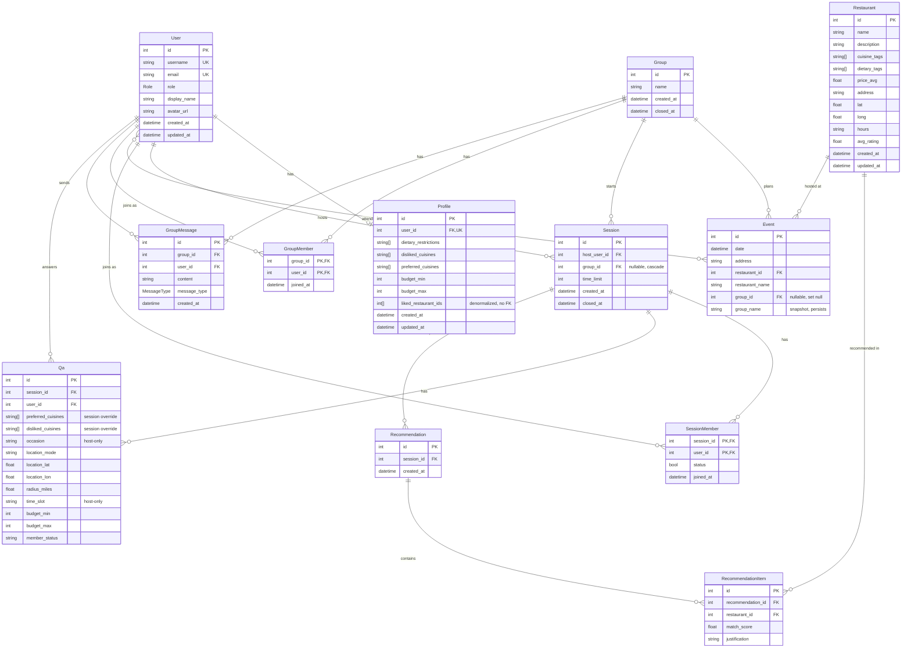

# Database Schema

Visual reference for the GrubGroup database. This is a **hand-maintained mirror** of
[`schema.prisma`](./schema.prisma) — update it when the schema changes.

The diagram below renders automatically in GitHub and the VSCode markdown preview.

## ER Diagram

## Relationships

| From | To | Type | Via | Notes |
|------|-----|------|-----|-------|
| User | Profile | 1 : 0..1 | `Profile.user_id` (unique) | Each user has at most one profile. Cascade delete. |
| User | Session | 1 : n | `Session.host_user_id` | A user hosts many sessions (`"SessionHost"`). |
| User | SessionMember | 1 : n | `SessionMember.user_id` | Join model — sessions a user belongs to. Cascade delete. |
| Session | SessionMember | 1 : n | `SessionMember.session_id` | Join model — members of a session. Cascade delete. |
| Session | Qa | 1 : n | `Qa.session_id` | One Qa row **per member** (`@@unique([session_id, user_id])`) — each member's session-scoped overrides (`"SessionQas"`). Cascade delete. |
| User | Qa | 1 : n | `Qa.user_id` | The member whose session overrides this Qa row holds. Cascade delete. |
| Session | Recommendation | 1 : n | `Recommendation.session_id` | Recommendation sets generated for a session. Cascade delete. |
| Recommendation | RecommendationItem | 1 : n | `RecommendationItem.recommendation_id` | Join model — one row per recommended restaurant. Cascade delete. |
| Restaurant | RecommendationItem | 1 : n | `RecommendationItem.restaurant_id` | Restaurant referenced by many recommendation items. |
| Restaurant | Event | 1 : n | `Event.restaurant_id` | Events held at a restaurant. |
| User | Event | m : n | implicit `_EventAttendees` | Event attendees (`"EventAttendees"`). Prisma-managed join table. |
| Group | Session | 1 : n | `Session.group_id` (nullable) | A group starts sessions. **Cascade** — deleting a group deletes its (live/transient) sessions. |
| Group | Event | 1 : n | `Event.group_id` (nullable) | A group plans many events. **SetNull** on delete — event survives, `group_id` → null, `group_name` snapshot persists. |
| Group | GroupMember | 1 : n | `GroupMember.group_id` | Join model — members of a group. Cascade delete. |
| User | GroupMember | 1 : n | `GroupMember.user_id` | Join model — groups a user belongs to. Cascade delete. |
| Group | GroupMessage | 1 : n | `GroupMessage.group_id` | Messages in a group. Cascade delete. |
| User | GroupMessage | 1 : n | `GroupMessage.user_id` | Message author. |

## Join models (why they exist)

Three tables exist to store data *about a link* between two others, rather than a plain
many-to-many. This keeps per-link data FK-backed and avoids fragile parallel arrays:

- **`SessionMember`** — carries each member's `status` and `joined_at`.
- **`GroupMember`** — carries each member's `joined_at`.
- **`RecommendationItem`** — carries each recommended restaurant's `match_score` and `justification`.

Access in code via `include`, e.g. `session.members[].user`, `recommendation.items[].restaurant`.

## Enums

| Enum | Values |
|------|--------|
| `Role` | `USER`, `OWNER`, `ADMIN` |
| `MessageType` | `TEXT`, `IMG`, `SYSTEM`, `SESSION_BLOCK` |

## Notes

- **`Profile.liked_restaurant_ids`** is a plain `Int[]` column (denormalized list of restaurant
  IDs), **not** a managed relation — so it has no FK integrity and does not appear as an edge in
  the diagram. To resolve to full restaurants, query separately:
  `prisma.restaurant.findMany({ where: { id: { in: profile.liked_restaurant_ids } } })`.
- **`Event.restaurant_name`** is a denormalized display field alongside the `restaurant_id` FK.
- **Group deletion is asymmetric by design.** A Session is live/transient, so deleting its group
  **cascades** (the session dies with it). An Event is a historical record, so deleting its group
  uses **SetNull**: the event survives with `group_id` null but keeps `group_name` — a snapshot of
  `Group.name` copied at creation. Frontend shows `group_name` and, when `group_id` is null,
  emphasizes that the group has been deleted.
- **`Qa` is per-member and session-scoped.** Each member's QA sub-agent writes exactly one Qa row
  (`@@unique([session_id, user_id])`) holding that member's **temporary** overrides for this session
  only — `preferred_cuisines` / `disliked_cuisines` / `budget_*` / `location_*`. These **outrank the
  durable `Profile`** for the session (e.g. profile likes Japanese but Qa says Mexican → Mexican
  weighted higher, Japanese still counted). `occasion` and `time_slot` are **host-only**: only the
  `Session.host_user_id` member's row carries them; a non-host's row leaves them null. There is **no
  `Session.avg_budget`** — the averaged group budget is computed on demand from members' effective
  `budget_max` by the ai_service orchestrator.
- **Event creation flow:** all members fill the Q&A (or the session times out) → AI agent produces
  recommendations → the host confirms one option → an Event is created, reading `session.group_id`
  to stamp `group_id` and copy the group's current `name` into `group_name`, and the session's `Qa`
  rows are **deleted** (temporary session data — see `closeSession`).
- `Restaurant`'s `owner_user_id` / `is_published` (whiteboard "stretch" fields) are intentionally
  omitted for now.
